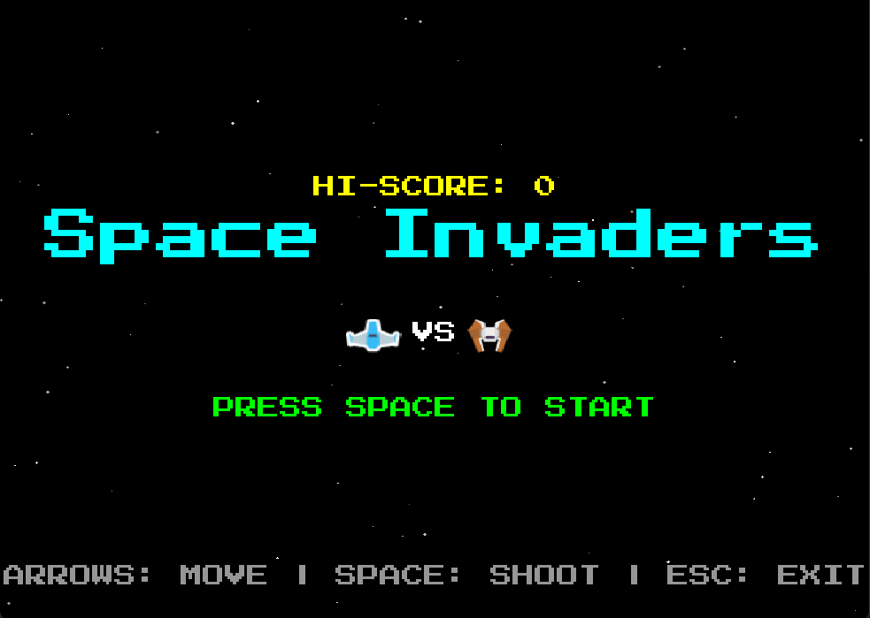
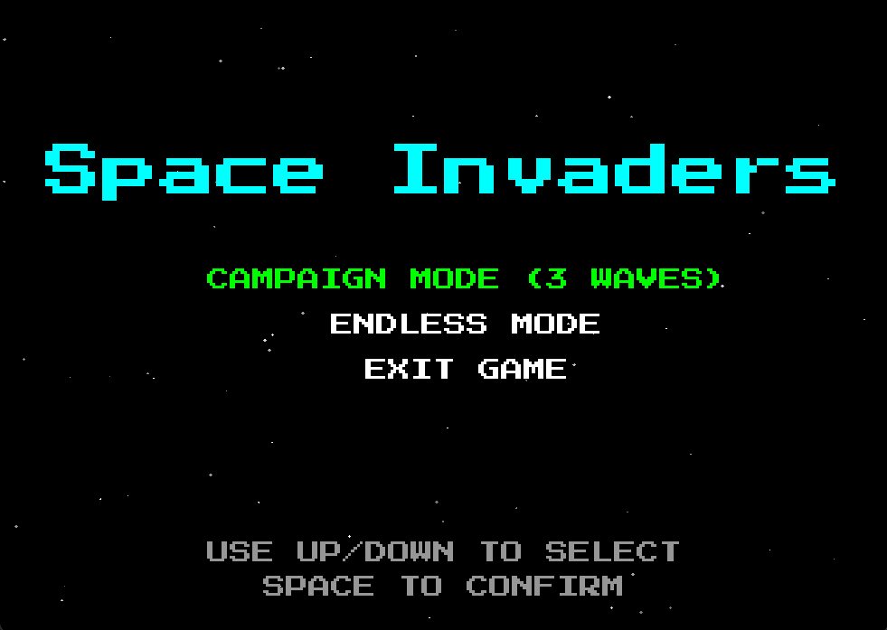
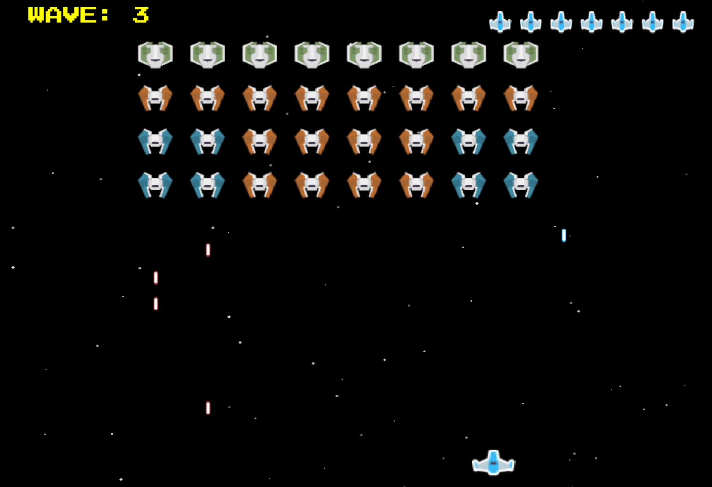
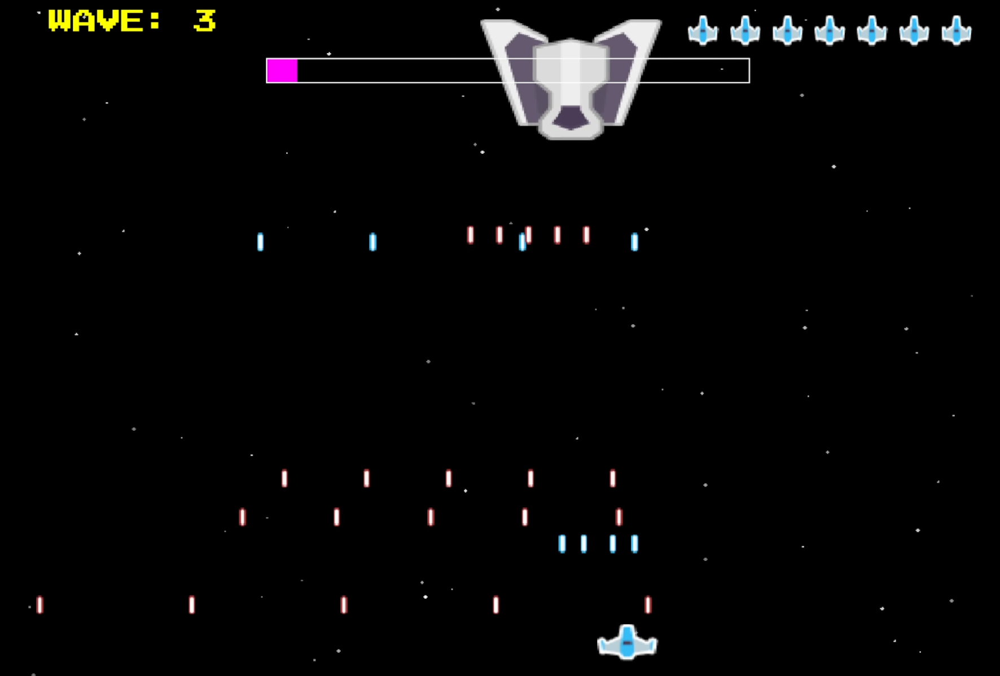

[English](#english) | [繁體中文](#繁體中文)

# English

# Space Invaders: Java Edition

A classic Space Invaders implementation developed in Java utilizing the standard AWT and Swing libraries. The project integrates standard matrix-based enemy movement mechanics, dynamic wave scaling, and a custom physics engine for AABB collision detection.

## System Features

### Core Mechanics
* **Endless Wave System**: Computes and manages an infinite progression of enemy matrices, dynamically scaling descent velocity upon matrix clearance.
* **Boss Entity Generation**: Injects a high-durability Boss entity every 5 waves, modifying the standard grid-based enemy instantiation pipeline.
* **Probability-Driven Power-Up**: Implements a probabilistic drop mechanism triggering weapon upgrades (Dual-Parallel Projectiles) upon collection.
* **AABB Collision Physics**: Calculates discrete Axis-Aligned Bounding Box intersections to resolve entity overlapping (Projectiles vs. Enemies, Enemies vs. Player).

### Graphics Rendering
* **Passive View Rendering**: Utilizes standard Java `Graphics` API driven by a decoupled GameModel for discrete rectangular rendering and UI metric overlays (Score/Wave).
* **Color-Coded Entities**: Employs primitive geometric rendering with distinct RGB constants to differentiate Entity variants.

### Audio Processing
* **External Library Integration**: Incorporates `MagicAudioPlayer` dependency to handle background music (BGM) and discrete Sound Effects (SFX) asynchronously.

### Software Architecture
* **Strict MVC Pattern**: Completely decouples state memory (`GameModel`), visual output (`GamePanel`), and user input routing/physics (`GameController`).
* **Rich Domain Model Entities**: Encapsulates discrete translation vectors and boundary data within respective `Entity` subclasses (`Player`, `Enemy`, `Bullet`), preventing Controller bloat.
* **Fixed Time-Step Game Loop**: Executes via a primary Thread utilizing nanosecond-precision delta time accumulation to normalize physics updates at 60 FPS across varied hardware.

## Installation & Usage

### Prerequisites
* Java Runtime Environment (JRE) 8 or higher.

### Initialization
1. Clone the repository or extract the release archive.
2. Verify that `SpaceInvaders.jar` and the `lib/` directory reside in the same root path.
3. Execute the binary via terminal or command prompt:
   ```bash
   java -jar SpaceInvaders.jar
   ```
4. Alternatively, execute the bundled `StartGame.bat` script for instant deployment.

### Input Mapping
* **Arrow Left / Right**: Translate horizontal coordinates
* **Space**: Fire Projectile

## UI Documentation

### Main Menu

*Figure 1: Main menu module illustrating the application entry point.*

### Mode Selection

*Figure 2: Interface for selecting gameplay modes.*

### Level Mode (Stage 3)

*Figure 3: Advanced gameplay state illustrating Stage 3 of Level Mode.*

### Final Boss Enrage State

*Figure 4: The climactic encounter showcasing the final boss's enrage mechanics.*

---

<br>
<br>

# 繁體中文

# Space Invaders: Java Edition

以純 Java 開發並依賴 AWT 與 Swing 函式庫之經典太空侵略者 (Space Invaders) 專案。本專案整合了標準的矩陣敵軍位移邏輯、動態波次難度曲線，並實作自定義之 AABB 碰撞物理引擎。

## 系統功能

### 核心機制
* **無盡波次系統 (Endless Wave)**：動態管理並演算無限輪迴之敵軍陣列，並於清除當前矩陣時套用速率遞增常數。
* **頭目實體生成 (Boss Generation)**：以 5 波次為週期，覆寫常規矩陣生成管線，注入具備高耐久值 (HP) 之 Boss 實體。
* **機率性強化觸發 (Power-Up)**：實作基於偽隨機數之掉落機制，觸發後即時重構玩家之彈道生成模式（單發切換為雙排直射）。
* **AABB 物理碰撞引擎**：計算離散之軸對齊邊界框 (Axis-Aligned Bounding Box) 交集，用以仲裁實體重疊（子彈對敵、敵對玩家）與邊界判定。

### 圖形渲染
* **被動視圖渲染 (Passive View)**：基於解耦之 `GameModel` 狀態，利用 Java 原生 `Graphics` API 進行離散幾何圖形與 UI 指標（分數/波次）之逐幀繪製。
* **實體色碼標記**：利用高對比 RGB 常數實作基礎幾何渲染以明確標記實體分類。

### 音訊處理
* **外部函式庫掛載**：封裝 `MagicAudioPlayer` 依賴庫，以非同步執行緒處理背景音樂 (BGM) 與環境音效 (SFX) 之 I/O 串流。

### 軟體架構
* **嚴格 MVC 設計模式**：徹底解耦系統狀態記憶 (`GameModel`)、視圖渲染 (`GamePanel`) 以及物理與輸入邏輯收發 (`GameController`)。
* **充血領域模型 (Rich Domain Model)**：將獨立之位移向量與邊界數據封裝於各 `Entity` 衍生類別（如 `Player`, `Enemy`, `Bullet`）內部，以阻斷 Controller 的過度膨脹。
* **固定步長邏輯迴圈 (Fixed Time-Step)**：透過主執行緒累積奈秒級 (Nanosecond) 之 Delta Time 參數，確保在異質硬體環境下皆能維持 60 FPS 之物理更新恆定率。

## 安裝與起始

### 環境需求
* Java Runtime Environment (JRE) 8 及其後續版本。

### 執行步驟
1. 取得專案原始碼，或下載封裝完成之發布包。
2. 確保 `SpaceInvaders.jar` 與 `lib/` 目錄（包含外部依賴庫）存在於相同之相對路徑下。
3. 於命令列介面執行以下指令啟動：
   ```bash
   java -jar SpaceInvaders.jar
   ```
4. 或直接雙擊附帶之 `StartGame.bat` 腳本進行快速部署。

### 系統輸入對應
* **左 / 右方向鍵**：水平對應座標移動
* **空白鍵 (Space)**：發射彈道

## UI 介面參照

### 遊戲主頁面

*圖一：主選單模組，展示遊戲初始之啟動排版結構。*

### 選擇模式畫面

*圖二：遊戲模式選擇介面。*

### Level Mode (第三關)

*圖三：Level Mode 第三關之高階運行狀態，展示進階矩陣與特效。*

### 最終 Boss 暴怒型態

*圖四：系統終端戰鬥，展示最終 Boss 觸發暴怒 (Enrage) 機制之高壓狀態。*
